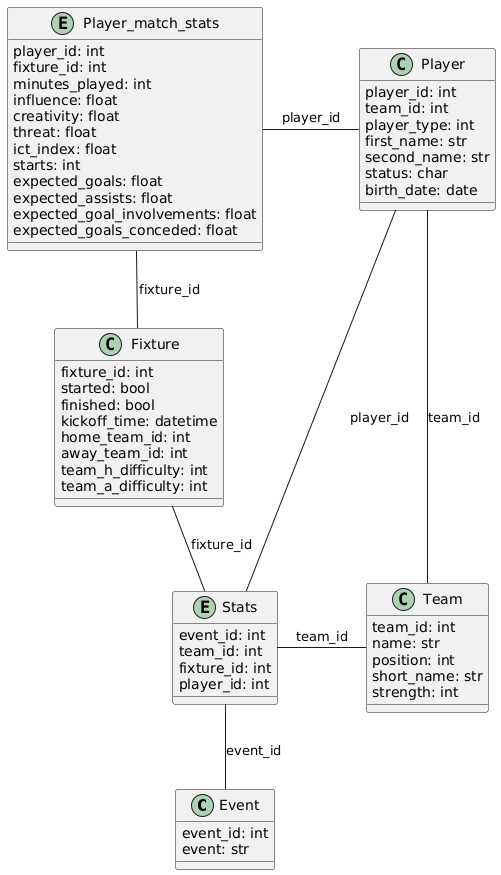

# Schemas



# Plantuml code for the schemas for the tables

- paste it here to visualise and edit `https://www.planttext.com/`

```
@startuml

class Event {
    event_id: int
    event: str
}

entity Stats {
    event_id: int
    team_id: int
    fixture_id: int
    player_id: int
}

entity Player_match_stats {
    player_id: int
    fixture_id: int
    minutes_played: int
    influence: float
    creativity: float
    threat: float
    ict_index: float
    starts: int
    expected_goals: float
    expected_assists: float
    expected_goal_involvements: float
    expected_goals_conceded: float
}

class Player {
    player_id: int
    team_id: int
    player_type: int
    first_name: str
    second_name: str
    status: char
    birth_date: date
}


class Team {
    team_id: int
    name: str
    position: int
    short_name: str
    strength: int
}

class Fixture {
    fixture_id: int
    started: bool
    finished: bool
    kickoff_time: datetime
    home_team_id: int
    away_team_id: int
    team_h_difficulty: int
    team_a_difficulty: int
}

Player - Team : team_id
Player_match_stats - Player : player_id
Player_match_stats -- Fixture : fixture_id
Fixture -- Stats : fixture_id
Player - Stats : player_id
Stats - Team : team_id
Stats -- Event : event_id
@enduml
```
